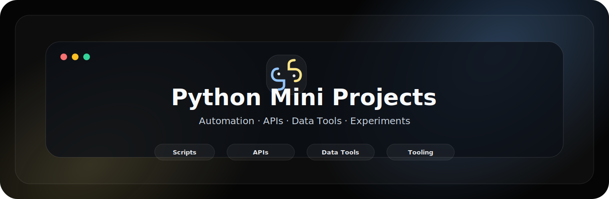
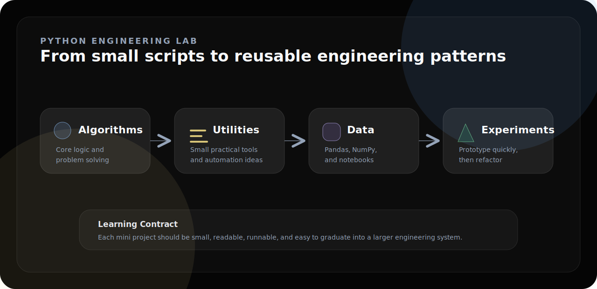
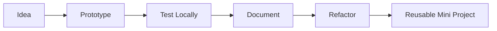

<div align="center">



<br />

<p>
  <strong>Build small.</strong> <strong>Learn fast.</strong> <strong>Refactor into reusable Python patterns.</strong>
</p>

<p>
  
  
  
  
</p>

</div>

---

<div align="center">

<table>
<tr>
<td align="center" width="25%"><strong>Type</strong><br />Python Lab</td>
<td align="center" width="25%"><strong>Scope</strong><br />Mini Projects</td>
<td align="center" width="25%"><strong>Focus</strong><br />APIs + Automation</td>
<td align="center" width="25%"><strong>Mode</strong><br />Learning Repository</td>
</tr>
</table>

</div>

---

## 01 · Overview

<table>
<tr>
<td width="58%" valign="top">

### A curated Python engineering sandbox

This repository collects Python mini projects across APIs, automation, scraping, backend utilities, data workflows, and practical application ideas.

The goal is to keep each project small, readable, runnable, and useful as a building block for larger engineering systems.

</td>
<td width="42%" valign="top">

```text
┌──────────────────────────────┐
│  PYTHON PROJECT LAB          │
├──────────────────────────────┤
│  Scripts     Utilities       │
│  APIs        Integrations    │
│  Data        Pandas / NumPy  │
│  Backend     Flask Patterns  │
│  Output      Reusable Ideas  │
└──────────────────────────────┘
```

</td>
</tr>
</table>

---

## 02 · Lab Map



---

## 03 · Project Categories

<table>
<tr>
<td width="25%" valign="top">

### API Apps

Projects that connect with external APIs for weather, stocks, NASA imagery, Reddit, and other services.

</td>
<td width="25%" valign="top">

### Automation

Scripts for automated reports, data collection, and repetitive workflow reduction.

</td>
<td width="25%" valign="top">

### Data Tools

Pandas and scraping workflows for collecting, cleaning, and analyzing structured data.

</td>
<td width="25%" valign="top">

### Backend Patterns

Flask and REST API experiments for lightweight server-side project development.

</td>
</tr>
</table>

---

## 04 · Included Projects

| Project | Focus |
|---|---|
| Speech To Text | Flask-based speech recognition workflow. |
| Company Profile Finder | Financial data lookup and Pandas processing. |
| Weather Finder Dashboard | OpenWeather API dashboard concept. |
| Automated Weather Report | Scheduled report generation workflow. |
| GitHub Repo Scraping | Repository data scraping and tabular analysis. |
| NASA Image API Project | API-driven image discovery application. |
| YouTube Trending Scraper | Trending-video data extraction. |
| Reddit API | Reddit data integration experiment. |
| Stock API / Stock Finder | Financial market lookup utilities. |
| Wordle Game | Python game logic implementation. |
| REST API | Backend service architecture experiment. |

---

## 05 · Workflow



---

## 06 · Installation

```bash
git clone https://github.com/ns7523/Python-mini-projects.git
cd Python-mini-projects
python -m venv .venv
source .venv/bin/activate
pip install notebook pandas numpy flask requests beautifulsoup4
```

---

## 07 · Usage

Run Python scripts:

```bash
python path/to/script.py
```

Run Flask projects:

```bash
python app.py
```

Launch notebooks:

```bash
jupyter notebook
```

---

## 08 · Project Structure

```text
.
├── assets/
│   └── brand/
│       ├── hero.svg
│       └── lab-map.svg
├── project folders
└── README.md
```

Suggested production structure:

```text
projects/ · notebooks/ · docs/ · assets/screenshots/ · requirements.txt
```

---

## 09 · Visual Assets

<table>
<tr>
<td width="50%" valign="top">

### Project Index

`assets/screenshots/project-index.png`

A clean overview of available mini projects.

</td>
<td width="50%" valign="top">

### API Demo

`assets/screenshots/api-demo.png`

A representative API or Flask project output.

</td>
</tr>
<tr>
<td width="50%" valign="top">

### Notebook Output

`assets/screenshots/notebook-output.png`

Example notebook result or data visualization.

</td>
<td width="50%" valign="top">

### CLI Run

`assets/screenshots/cli-run.png`

Terminal output from a representative script.

</td>
</tr>
</table>

---

## 10 · Future Improvements

- [ ] Organize projects into category folders.
- [ ] Add one README per mini project.
- [ ] Add a root `requirements.txt`.
- [ ] Add screenshots for selected projects.
- [ ] Add tests for reusable scripts.
- [ ] Add a formal open-source license.

---

<div align="center">

### N S Akash

**AI & Cybersecurity Engineer**

<p>
  <a href="https://github.com/ns7523"></a>
  <a href="https://nsakash.in"></a>
  <a href="mailto:contact@nsakash.in"></a>
  <a href="https://www.linkedin.com/in/nsakash7523"></a>
</p>

</div>
